# PCB Fiber Laser Fabrication Instruction

## 1. Overview

This document outlines the standard operating procedure (SOP) for fabricating 2 Layer Printed Circuit Boards (PCBs) using a fiber laser. This SOP will take you through the entire process in detail from file preparation to post-processing.

### Process Summary

The fabrication process involves the following key stages:

1.  **File Preparation**: Exporting Gerber files from KiCad and converting them into laser-ready vector formats (SVG) using FlatCAM.
2.  **Copper Etching**: Using the fiber laser to ablate unwanted copper, explicitly isolating the circuit traces.
3.  **Solder Mask & Silkscreen**: Applying a generic UV-curable solder mask paint over the entire board. After curing, the fiber laser is used to selectively remove (ablate) the paint from soldering pads, serving as a digital alternative to traditional photo-lithography. There are two layers of solder mask in a side of a PCB, one for the silkscreen which lies underneath and one on the top for the solder mask.
4.  **CNC Router**: Drilling holes and cutting the board to shape.

**Note:** This SOP doesn't cover how to make plated holes, but there are a bunch of methods to get around it. For example, soldering wires through the holes to connect the traces on the top and bottom layers. Or you can use small rivets or just move the components up from the board a little bit and solder the pins directly to the traces on the top or bottom layer.

### Prerequisites

- You have a PCB design in KiCad 9.0 that follows my design rules [KiCAD_Custom_DRC_Rules_for_KPPCB](KiCAD_Custom_DRC_Rules_for_KPPCB).
- You have installed the required software. (e.g. KiCad 9.0, FlatCAM, BslAppSimple) If not see the installation guide at the end of this document.
- You know how to use Fiber Laser and basics of laser control software (BslAppSimple).
- You know how to use CNC Router and basics of CNC control software (Mach3).

### Reference Video

- [Homemade PCBs with Fiber Laser - 0.1mm Clearance (Electronoobs)](https://www.youtube.com/watch?v=PoYcjyghDx4)

## 2. Requirements

### Materials

- **PCB Material:** FR1 or FR4 PCB board.
- **Solder Mask:** UV Curable Solder Mask. Get two colors if you are going to plot silkscreen layer.
  (e.g. green and white)
- **Thick Black Paper:** For aligning the PCB on the Fiber Laser bed
- **Cleaning Supplies:** Isopropyl alcohol (IPA), lint-free wipes

### Tools

- **Fiber Laser:** For etching copper and solder mask layer
- **CNC Router:** For cutting and drilling
- **UV Light Source:** For curing solder mask layer
- **Silkscreen Mesh:** For applying solder mask and silkscreen.
- **Fine Grid Sand Paper:** For cleaning the PCB
- **Drill Bit:** For drilling holes (e.g. 0.8mm, 1.0mm, etc.)
- **Cutting Bit:** For cutting the board (e.g. 2.0mm, 2.4mm, etc.)
- **0.8mm Pins:** For aligning the board to the CNC bed. Found in 2.54mm pitch male pin header

### Software (My case)

- **PCB Designing Software:** KiCad 9.0
- **CAM Software:** FlatCAM 8.9
- **Fiber Laser Software:** BslAppSimple 5.2
- **CNC Router Software:** Mach3

## 3. Laser Calibration Test

- **Copper Etching Test:**
  - **Preparation:**
    - Download the test file [Laser Calibration Test](fiber_laser_calibration/test_files).
    - Clean the PCB using IPA and lint-free wipes.
    - Place the PCB on the laser bed.
    - Adjust the focus of the laser.
    - Run the program.
  - **Observation:**
    - Look for the one that ablates the most copper layer.
    - My personal settings: `Power: 100%`, `Speed: 1000mm/s`, `Frequency: 20kHz`,`Passes: 20`
  - **Save** the settings to **Pen 0** and name it `copper`.

- **Solder Mask Etching:**
  - **Preparation:**
    - Download the test file [Laser Calibration Test](fiber_laser_calibration/test_files).
    - Clean the PCB using IPA and lint-free wipes.
    - Apply the first layer of solder mask on the PCB.
    - Cure the solder mask using UV light source.
    - Apply the second layer of solder mask on the PCB.
    - Cure the solder mask using UV light source.
    - Place the PCB on the laser bed.
    - Adjust the focus of the laser.
    - Run the programs one by one.
  - **Observation:**
    - Look for the one that ablates the solder mask layer cleanly.
    - My personal settings for ablating only top layer: `Power: 10%`, `Speed: 1000mm/s`, `Frequency: 50kHz`, `Passes: 1`
    - My personal settings for ablating both layers: `Power: 60%`, `Speed: 1000mm/s`, `Frequency: 50kHz`, `Passes: 1`
  - **Save** the top-layer settings to **Pen 1** and name it `silk`.
  - **Save** the both-layers settings to **Pen 2** and name it `mask`.
  - **Note:**
    - Every board may have different thickness of solder mask, so you need to calibrate the settings for each face of the board.
    - You can use my test files to find the best settings for your board. (e.g. [Laser Calibration Test](fiber_laser_calibration/test_files)
- **Black Paper Cutting:**
  - **Preparation:**
    - Draw a simple rectangle in the BslAppSimple.
    - Place the black paper on the laser bed.
    - Adjust the focus of the laser.
    - Run the program.
  - **Observation:**
    - Look for the one that cuts the black paper cleanly in one pass with the fastest speed possible.
    - My personal settings: `Power: 100%`, `Speed: 100mm/s`, `Frequency: 30kHz`,`Passes: 1`
  - **Save** the settings to **Pen 3** and name it `paper`.

## 4.Software Setup

- **KiCAD:** Before start designing the PCB, import my design rules into you KiCAD project by going to **File > Board Setup... > Import Settings from Another Board...** find the KiCAD file and **Sellect All**, then **Import Settings**. [Download My Design Rules](KiCAD_Custom_DRC_Rules_for_KPPCB)
- **FlatCam:**
  - Import my tools database by going to **Options > Tools Database > Import DB**. [Download My Tools Database](flatcam_tools_database)
  - Show all tools by right-click on the tool bar and select all the tools.

## 5.Workflow

After you have designed the PCB, you can start the workflow.

This is my design. It is simple a 2-layer board with mounting components and silkscreen on both sides.

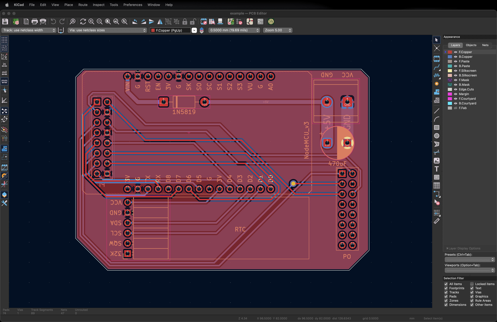

### 5.1 File Preparation

#### KiCad

Export the Gerber files in KiCad. Go to **File > Plot...** and fill in these settings:

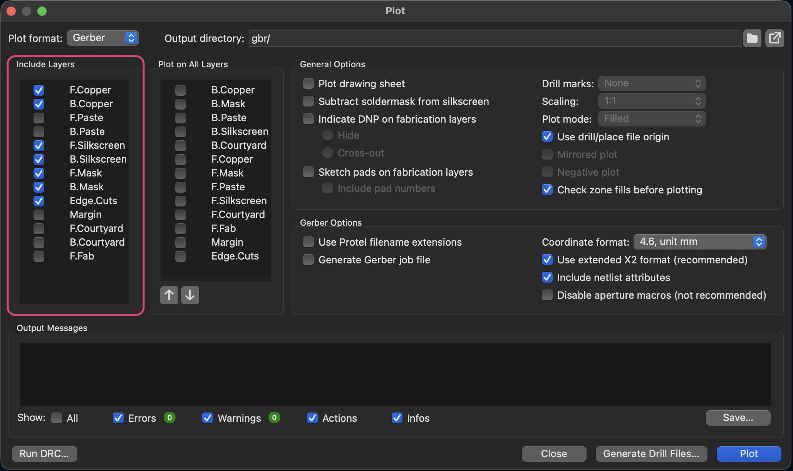

Select these layers:

- `F.Copper`
- `B.Copper`
- `F.Mask`
- `B.Mask`
- `F.Silkscreen`
- `B.Silkscreen`
- `Edge.Cuts`

Click **Plot**. Then **Generate Drill Files...**
Fill in these settings:

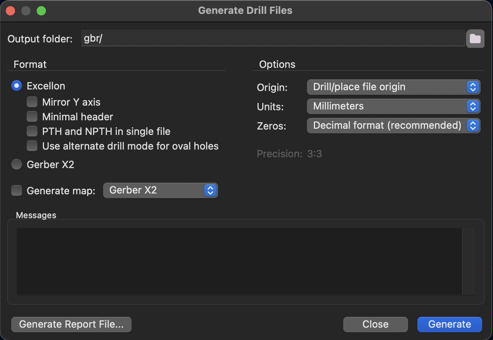

**_Note:_** _You may check the_ **_PTH and NPTH in a single file_**.

Then click **Generate**

#### FlatCAM

##### STEP 1 - Import Files

1. Open FlatCAM and **Import** all the **Gerber** files and **Drill** files.
   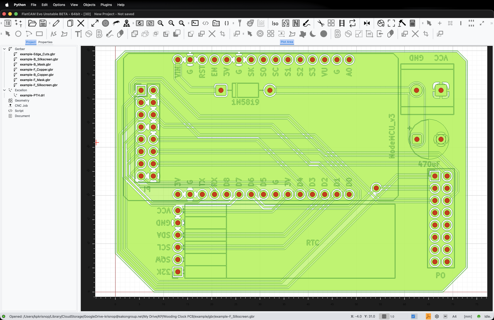

##### STEP 2 - Prepare `Edge_Cuts`

1. Create a **Follow** geometry object with `Edge_Cuts.gbr` using the **Follow plugin**.
   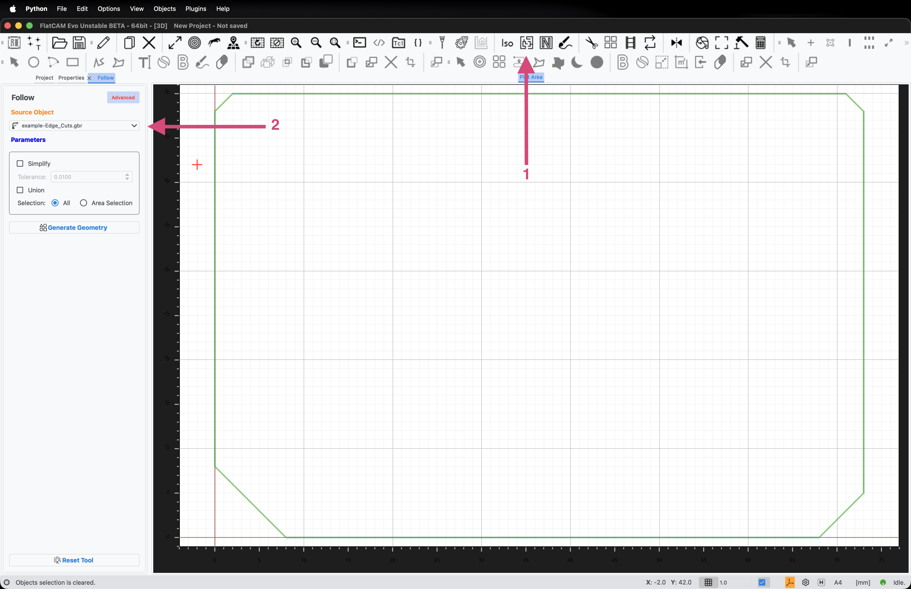
2. **Convert** the newly created geometry object (`Edge_Cuts_follow`) into a gerber object by going to **Edit > Conversion > Convert Any to Gerber**
   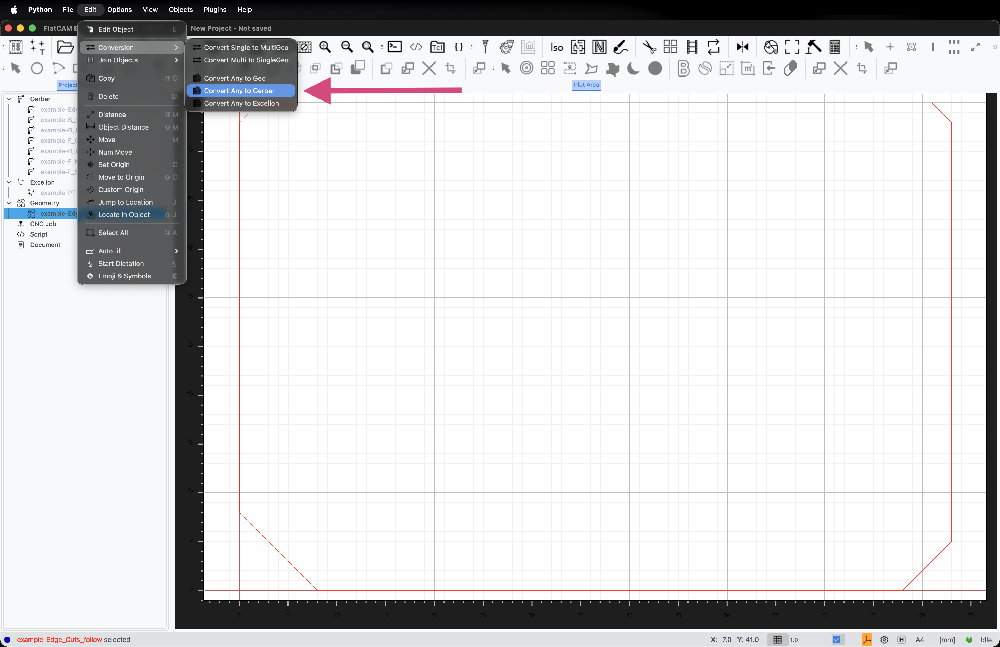
   You will get a filled shape named `Edge_Cuts_follow_conv`. Then, **Delete** `Edge_Cuts.gbr` and `Edge_Cuts_follow`.

##### STEP 3 - Board Placement

1. Move all objects to origin by **Sellect All**, right-click and **Move2Origin**
2. Create a blank board to help placing the board correctly and optimally.
   1. Go to **File > New > Geometry** (shortcut: **N**)
   2. Go to **Edit > Edit Object** (shortcut: **E**)
   3. Use **Rectangle Tool** (shortcut: **R**) to draw a rectangle exectly the size of your `Un-Cut PCB`. (e.g. 100mm x 150mm)
      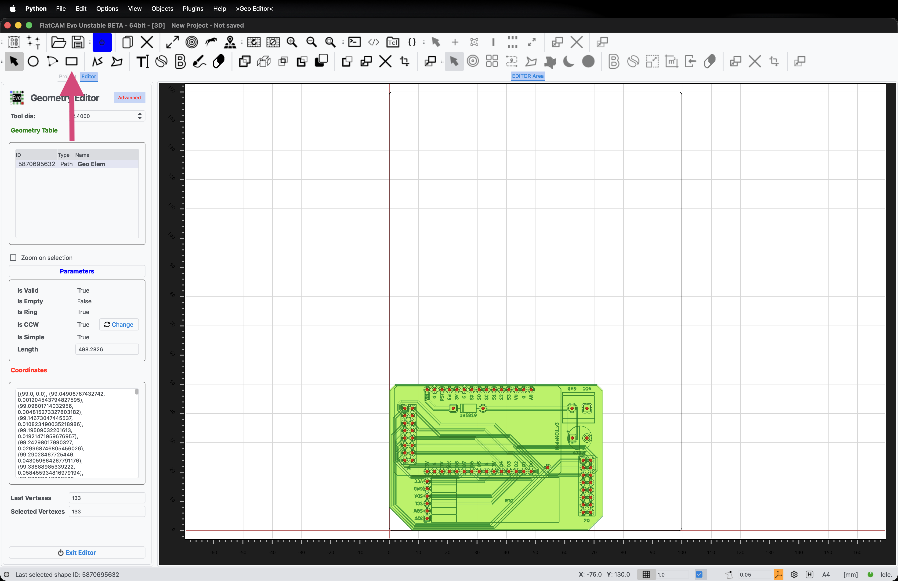
   4. Use **Buffer Tool** to create inner offset exectly the size of your `Clamping Space`. (e.g. 2mm)
      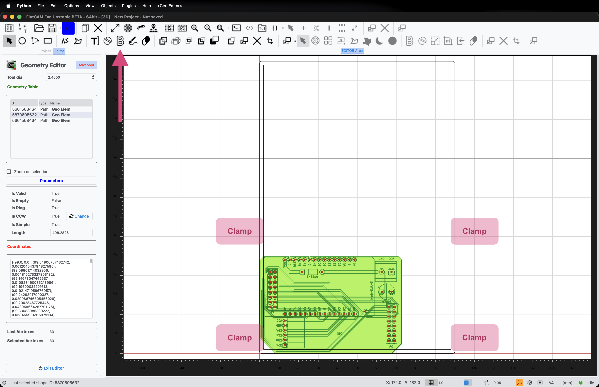
   5. **Exit** the editor and **Rename** the geometry as `blank`.
   6. Move all objects except `blank` inwards by the distance of `(Clamping Space + Clearance + Cutting Bit Diameter) x 2` in both _X_ and _Y_ direction. (e.g. `(2mm + 1mm + 2mm) x 2 = 10mm`)
      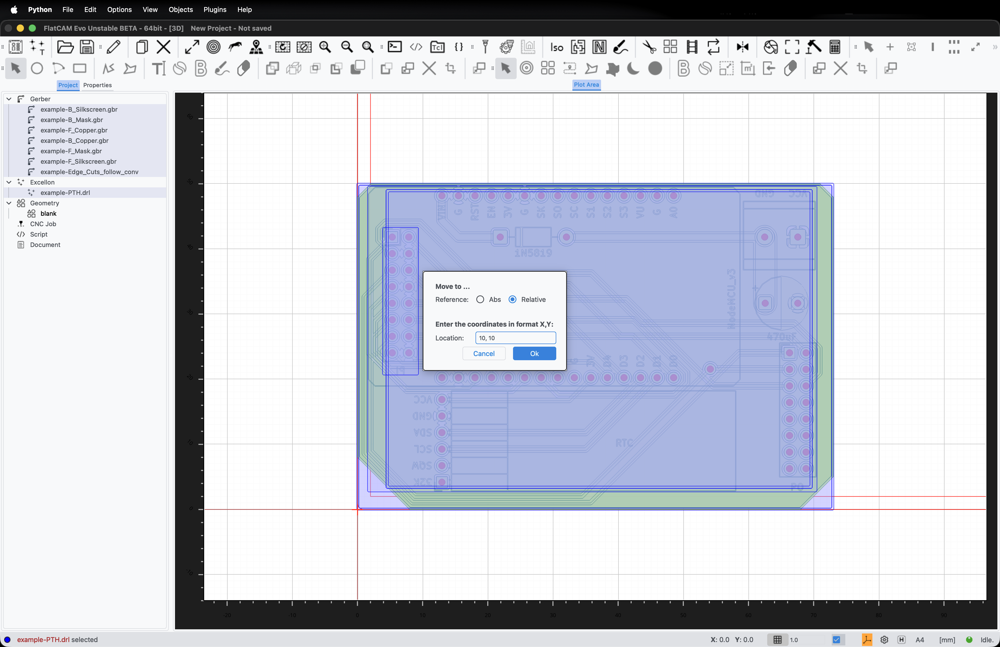

##### STEP 4 - Create Outer Cut

1. Create a new gerber object by going to **File > New > Gerber** (shortcut: **B**)
2. Go to **Edit > Edit Object** (shortcut: **E**)
3. Use **Region Tool** to draw a rectangle with an offset of `Clamping Space + Clearance + Cutting Bit Diameter`. You can extend the board further than this distance if the left over is unusable any way.
   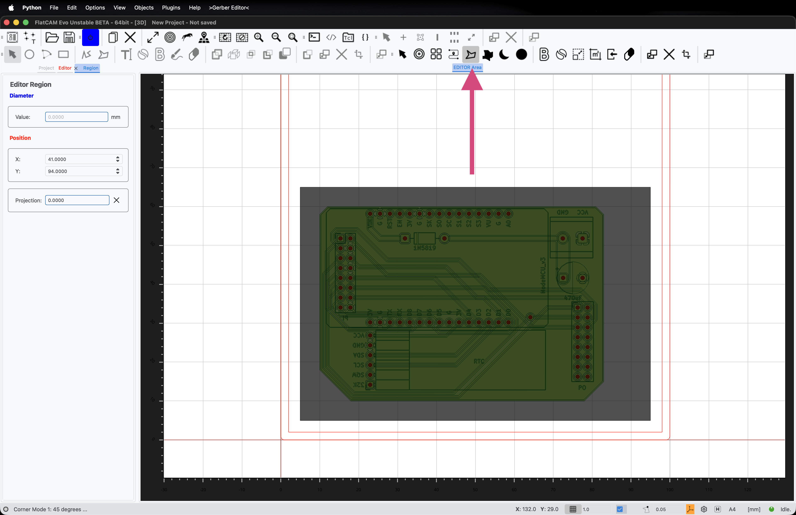
4. **Exit** the editor and **Rename** it as `outer`

##### STEP 5 - Create Alignment Drill Hole

1. Create a new excellon object by going to **File > New > Excellon** (shortcut: **L**)
2. Go to **Edit > Edit Object** (shortcut: **E**)
3. Use **Add Drill Tool** to add 4 drill holes on each corner of the `outer`, `Clamping Space` distance away from the corners.
4. Set the tool diameter to `0.8mm`
5. **Exit** the editor and **Rename** it as `pin`
   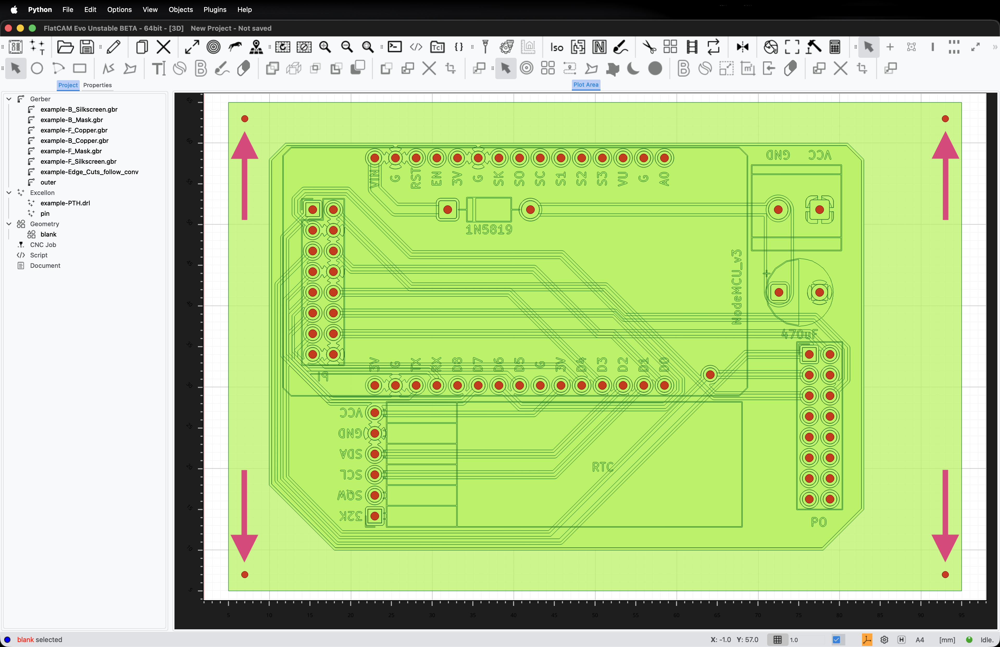

##### STEP 6 - Create Toolpath Geometry

1. Use **Cutout** plugin to create toolpath geometry for `Edge_Cuts_follow_conv`
2. Click **Pick from DB** and select the cutting tool from the database and click **Transfer the Tool**. (e.g. `cutout`)
   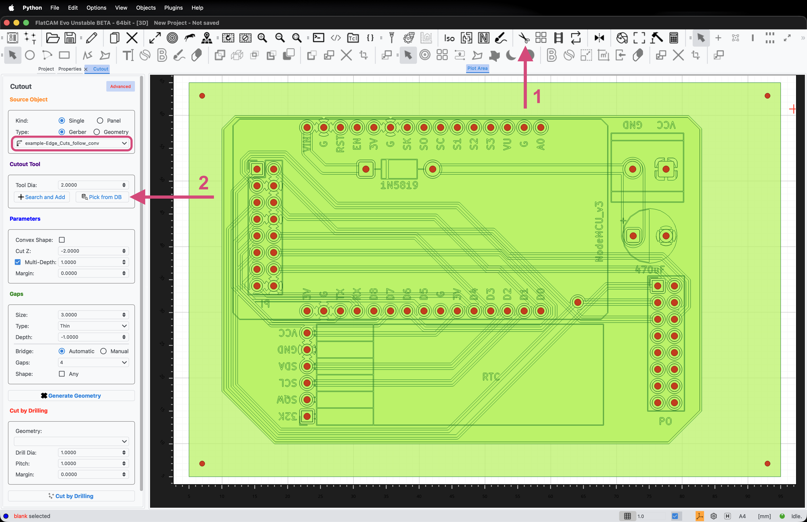
   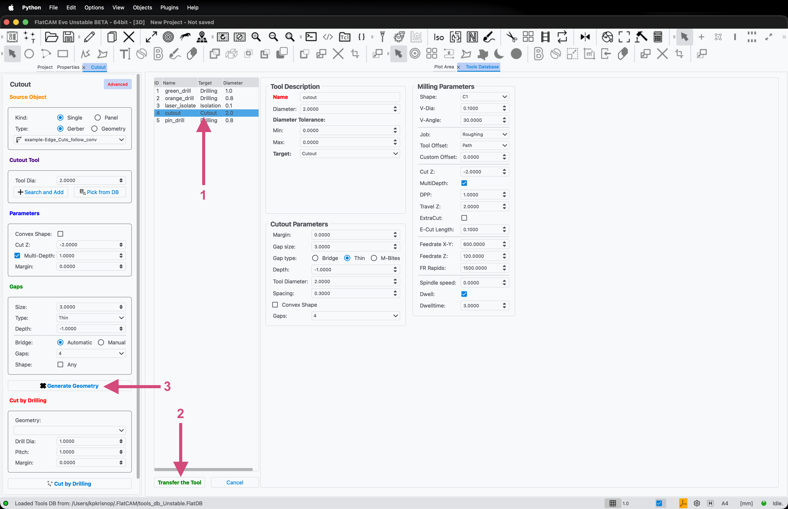
   My tool settings for 1.5mm thick FR4 PCB:
   - **`Tool`**: `cutout`
   - **`Tool Dia`**: `2.0000mm`
   - **`Cut Z`**: `-2.0000mm`
   - **`Gap size`**: `3.000`
   - **`Gap type`**: `Thin`
   - **`Gaps`**: `4`
   - **`Depth`**: `-1.0000mm`
   - **`MultiDepth`**: `True`
   - **`DPP`**: `1.0000mm`
   - **`Feedrate X-Y`**: `600.0000mm/min`
   - **`Feedrate Z`**: `120.0000mm/min`
   - **`Dwell`**: `True`
   - **`Dwell time`**: `3 (Depend on your CNC machine. Some machine 3 means 3 milliseconds, some means 3 seconds)`
3. Click **Generate Geometry**
4. Do the same to `outer`
5. At the end, you should have 2 toolpath geometries: `Edge_Cuts_follow_conv_cutout` and `outer_cutout`.

##### STEP 7 - Generate Isolate Geometry

1. Click on **Isolate** plugin to create laser toolpath geometry for `F_Copper.gbr`
   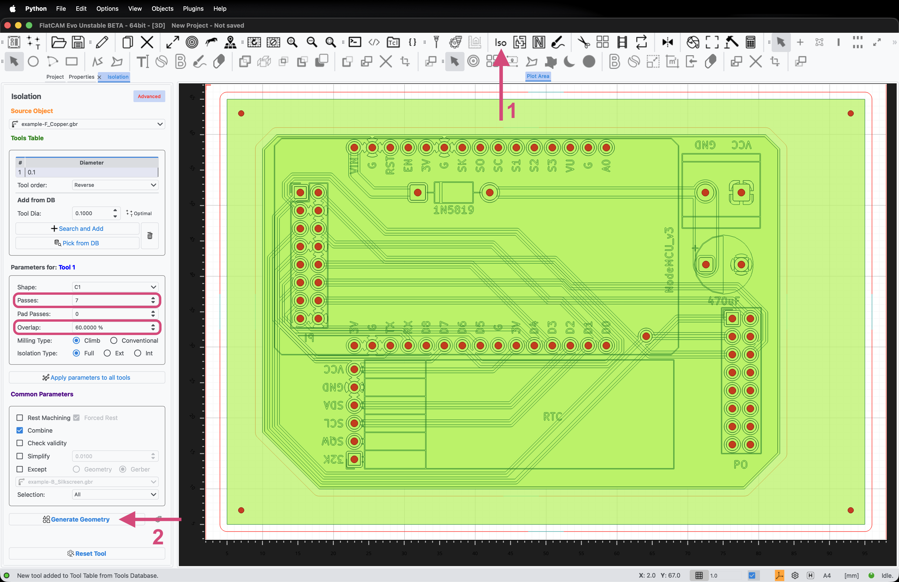
   My settings:
   - **`Diameter`**: `0.1000mm`
   - **`Passes`**: `7`
   - **`Overlap`**: `60.0000%`
2. Click **Generate Geometry**
3. Do the same to `B_Copper.gbr`
4. At the end, you should have 2 toolpath geometries: `F_Copper_iso_combined` and `B_Copper_iso_combined`.

##### STEP 8 - Export SVG Files

1. **Select** the following objects:
   - `outer`
   - `F_Copper_iso_combined`
   - `B_Copper_iso_combined`
   - `F_Mask.gbr`
   - `B_Mask.gbr`
   - `F_Silkscreen.gbr`
   - `B_Silkscreen.gbr`
2. **Run** the following **TCL Script** in the terminal

   ```tcl
   set output_path {/path/to/your/output/folder} ;# <--- Change this

   # This line strips any surrounding ' or " characters
   set output_path [string trim $output_path {'"}]
   file mkdir $output_path

   set object_list [get_active]

   foreach obj $object_list {
     set full_filename [file join $output_path "${obj}.svg"]

     if {[catch {export_svg $obj $full_filename} err]} {
         puts "Could not export $obj: $err"
     } else {
         puts "Successfully exported: $obj"
     }
   }
   ```

   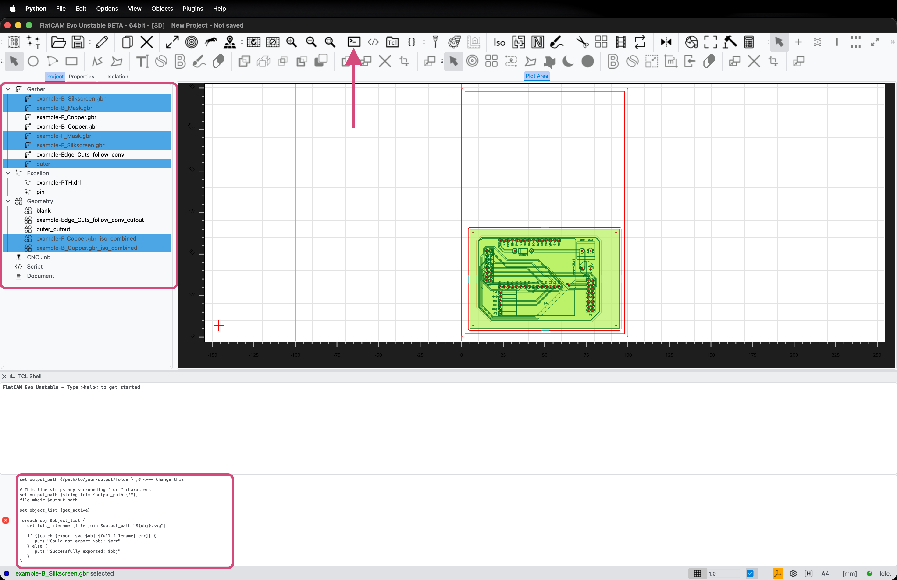
   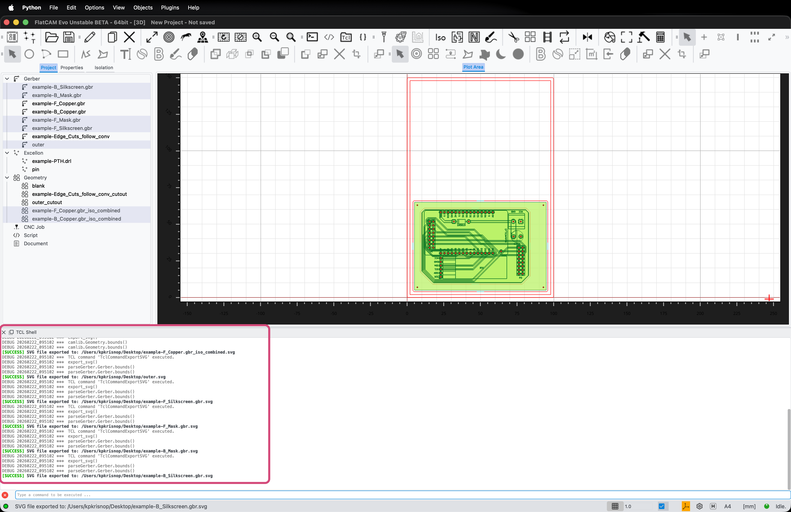

##### STEP 9 - Generate Cutting G-code Objects

1. Click on **Milling** plugin
2. Select `outer_cutout`
3. Click on **Generate CNCJob objects** button
   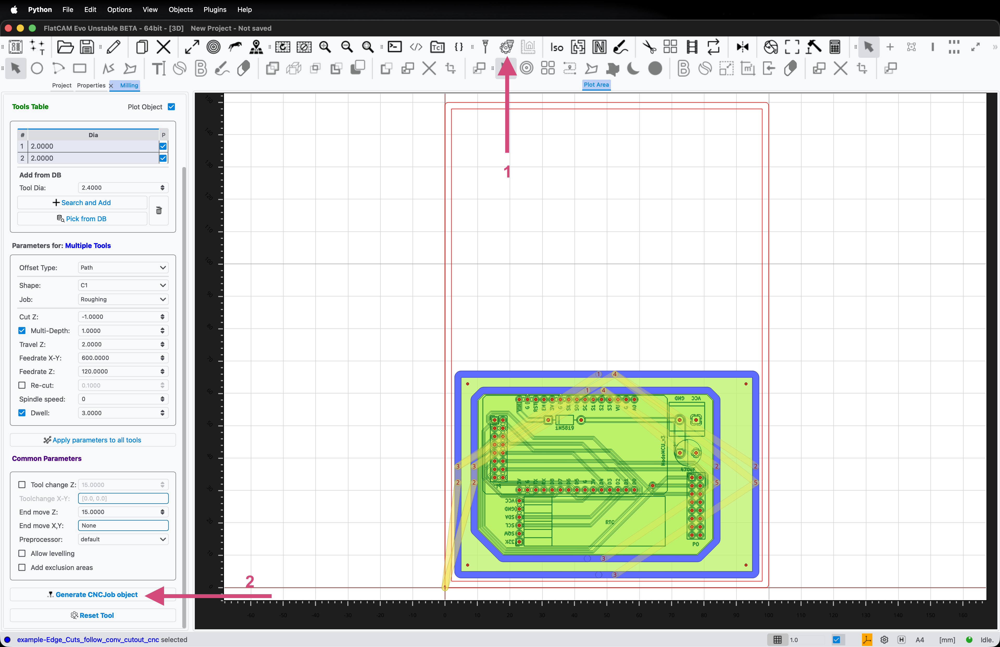
4. Do the same to `Edge_Cuts_follow_conv_cutout`
5. At the end, you should have 2 G-code objects: `outer_cutout_cnc`, `Edge_Cuts_follow_conv_cutout_cnc`.

##### STEP 10 - Generate Drilling G-code Objects

1. Click on **Drilling** plugin
2. Select `pin`
3. Pick the `0.8mm` drill tool from the database and click **Transfer the Tool**
   My Settings:
   - **`Tool Dia`**: `0.8000mm`
   - **`Cut Z`**: `-8.0000mm`
   - **`Feedrate Z`**: `120.0000mm/min`
   - **`Dwell`**: `True`
   - **`Dwell time`**: `3 (Depend on your CNC machine. Some machine 3 means 3 milliseconds, some means 3 seconds)`
4. Click on **Generate CNCJob objects** button
   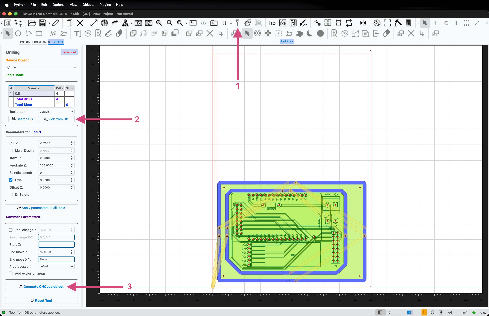
5. Do the same to `PTH.drl` and/or `NPTH.drl`. Select the correct drill size for each and make sure that all the drills holes with the same size are selected before clicking **Generate CNCJob objects** button.
6. At the end, you should have 2 (or more if you have more than 1 hole size) G-code objects: `pin_cnc`, and `PTH.drl_cnc` and/or `NPTH.drl_cnc`.

##### STEP 11 - Export G-code Objects

1. **Export** all the G-code objects by selecting all of them and right-click batch save.
   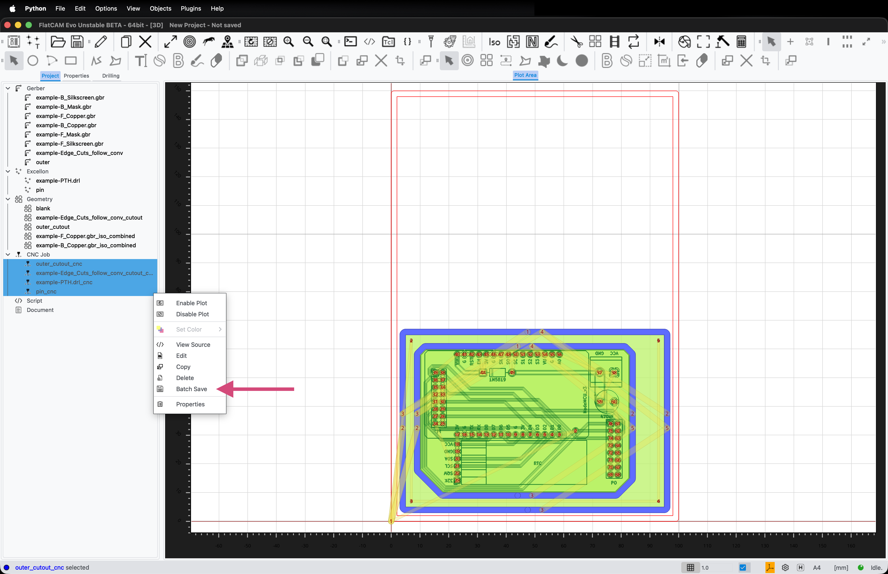

#### BslAppSimple

##### STEP 1 - Import SVG Files

1. Import the svg files by going to **File > Vector File** and select the svg files, one by one. Make sure you uncheck **Place to Origin**.
   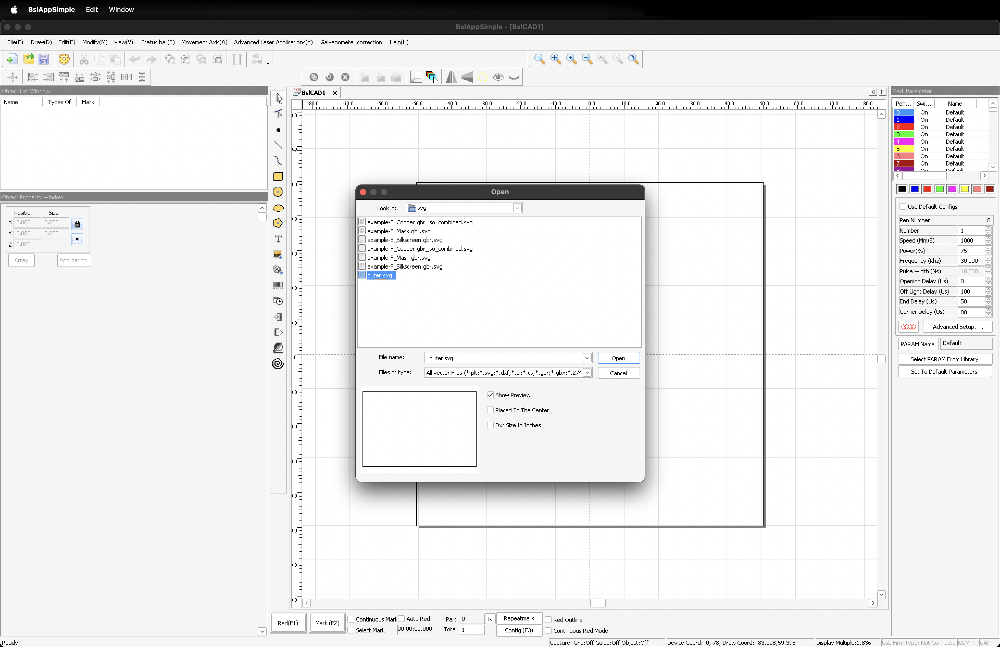
2. Select all and **Place to Origin**
   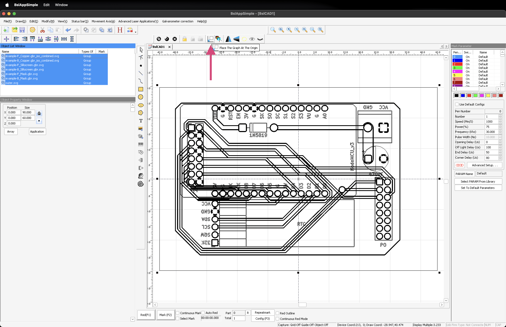

##### STEP 2 - Hatching

1. Select `F_mask`
2. Click on **Hatching**
   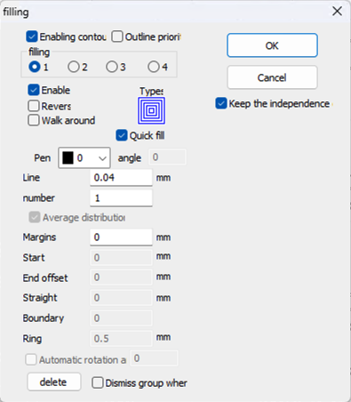
   My Settings:
   - **`Pattern`**: `ZigZag`
   - **`Walk Around`**: `True`
   - **`Cross Fill`**: `True`
   - **`Line`**: `0.04mm`
   - **`Margins`**: `-0.2mm`
3. **Rename** it `F_mask`
4. Click **OK**. Then, do the same for `B_mask`.

##### STEP 3 - Offset

1. Select `outer` and go to **Edit > Offset**.
2. Offset `-0.1mm` to compensate for laser burn expansion.
3. Select **Delete Old Curve** and left-click to offset.

##### STEP 4 - Save

1. Save the file

### 5.2 Operation

##### STEP 1 - CNC Preparation

1. Make sure the un-cut board in **Flat** and **Level** to the bed
2. **Insert** `0.8mm Carbide Drilling Bit`
3. Set the CNC coordinate **Origin** exactly to the **Bottom-Left corner**, on the **Top surface** of the board.
4. **Clamp** the board on the edge

##### STEP 2 - Cut `pin` then `outer`

1. **Run** `pin_cnc`
2. Insert `Carbide Cutting Bit (e.g. 2.0mm)`
3. **Re-zero Z ONLY** so that the cutting bit just touch the **Top surface** of the board
4. **Run** `outer_cutout_cnc`
5. Take the board out to **Remove** the left-over **Tabs**

##### STEP 3 - Laser Cutting Preparation

1. Tape a piece of **Black Paper** to a sheet of sacrificing laser-impenetrable material (e.g. MDF, Acrylic, etc.) and tape it on the laser bed.
2. Open **BslAppSimple** and use the **Select Mark** mode
3. **Select** the `outer` and start laser cutting with **Pen 3** mode
4. Test fit the board by placing it into the laser cut on the black paper and check if it wiggles. If it does, shrink the offset and repeat untill fit perfectly.

##### STEP 4 - Copper Traces Etching

1. Cut the `F_Copper_iso_combined`
2. Check the continuity of the copper traces with a multimeter before removing the board from the laser bed
3. Flip the board vertically in the laser bed
4. Select all objects and flip them vertically in the software
5. Cut the `B_Copper_iso_combined`
6. Check the continuity of the copper traces with a multimeter before removing the board from the laser bed

##### STEP 5 - Apply Solder Mask

1. Clean the board with IPA
2. Apply bottom solder mask (light color)
3. Cure bottom solder mask untill it is dry to the touch
4. Apply top solder mask over the bottom solder mask (dark color)
5. Cure top solder mask untill it is dry to the touch
6. Mark the board with a marker to indicate the orientation. **(CRITICAL)**
7. Repeat on the other side

##### STEP 6 - Remove Solder Mask

1. Place the board on the front side in the correct orientation
2. Run `F_mask` on the front side
3. Run `F_silkscreen` on the front side
4. Flip the board vertically in the laser bed and in the software
5. Run `B_mask` on the back side
6. Run `B_silkscreen` on the back side

##### STEP 7 - CNC Finishing Cut Preparation

1. Make sure the board is **Flat** and **Level** to the bed
2. **Insert** `Carbide Drilling Bit` and run the drilling program (e.g. `PTH.drl_cnc`) according the the drill bit size.
3. **Insert** `Carbide Cutting Bit` and run `Edge_Cuts_follow_conv_cutout_cnc`
4. Take the board out to **Remove** the left-over **Tabs**

##### Finished PCB:


## Software Installation

### KiCad 9.0

- Website: [Open](https://www.kicad.org/)
- Windows: [Open Download Page](https://www.kicad.org/download/windows/)
- MacOS: [Open Download Page](https://www.kicad.org/download/macos/)

### FlatCAM

- Website: [Open](http://flatcam.org/download)
- Windows: [Open Download Page](https://bitbucket.org/jpcgt/flatcam/downloads/)
- MacOS: [Open Download Page](https://github.com/tomoyanonymous/homebrew-flatcam) _In MacOS, I experienced minor bugs in the program, specifically in `flatcam-evo`. Nevertheless, I quickly debugged using the error messages in the program and fixed these bugs using AI (e.g. Gemini, ChatGPT, Claude)._
- MacOS My Improved Version: [Open Download Page](https://github.com/KP-Krisnop/homebrew-flatcam-evo) (Recommended)

### BslAppSimple

- Website: [Open](https://www.laserchina.com/bslapp/)
- Windows: [Open Download Page](https://www.laserchina.com/bslapp/)
