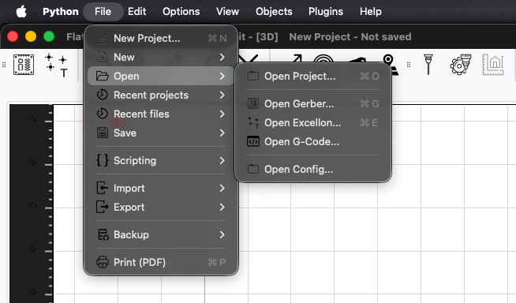
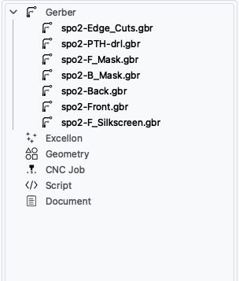
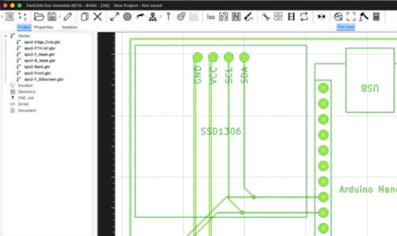
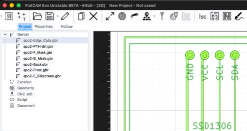
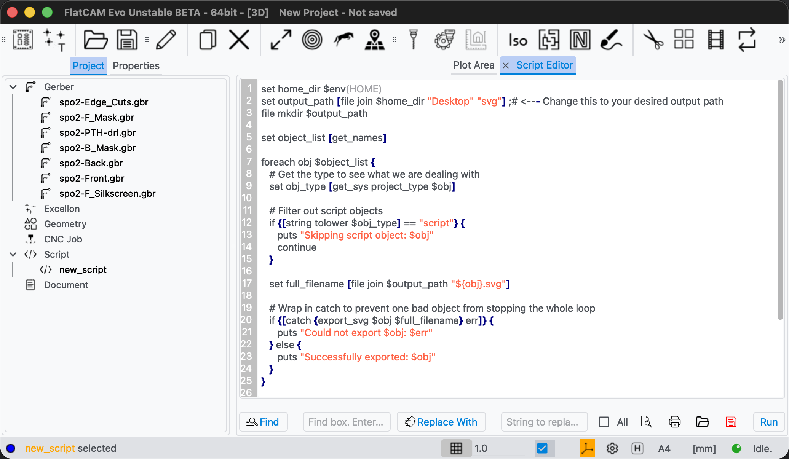
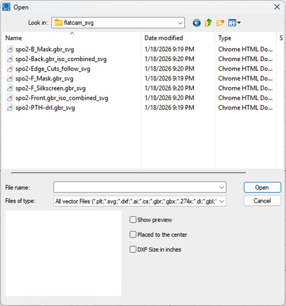

# PCB Fiber Laser Fabrication Instruction


## 1. Overview

This document outlines the standard operating procedure (SOP) for fabricating 2 Layer Printed Circuit Boards (PCBs) using a fiber laser. This SOP will take you through the entire process in detail from file preparation to post-processing.

### Process Summary
The fabrication process involves the following key stages:
1.  **File Preparation**: Exporting Gerber files from KiCad and converting them into laser-ready vector formats (SVG) using FlatCAM.
2.  **Physical Preparation**: Cutting the FR-1 board to shape and drilling holes (using a CO2 laser or mechanical tools).
3.  **Copper Etching**: Using the fiber laser to ablate unwanted copper, explicitly isolating the circuit traces.
4.  **Solder Mask & Silkscreen**: Applying a generic UV-curable solder mask paint over the entire board. After curing, the fiber laser is used to selectively remove (ablate) the paint from soldering pads, serving as a digital alternative to traditional photo-lithography.

### Prerequisites
- You have a PCB design in KiCad 9.0 that follows the design rules. (e.g. [PCBWay's design rules](https://www.pcbway.com/helpcenter/design_instruction/PCBWay_Custom_Design_Rules.html))
- You have installed the required software. (e.g. KiCad 9.0, FlatCAM, BslAppSimple) If not see the installation guide at the end of this document.
- You know how to use Fiber Laser and basics of laser control software (BslAppSimple).
- You know how to use CO2 Laser and basics of laser control software (CorelLaser).

### Reference Video
- [Homemade PCBs with Fiber Laser - 0.1mm Clearance (Electronoobs)](https://www.youtube.com/watch?v=PoYcjyghDx4)

## 2. Requirements

### Materials
- **PCB Material:** FR-1 PCB board. FR-4 will not work because the laser will burn the fiber glass content.
- **Solder Mask:** UV Curable Solder Mask. Get two colors if you are going to plot silkscreen layer.
 (e.g. green and white)  
- **Thick Paper:** For aligning the PCB on the Fiber Laser bed
- **Fine Grid Sand Paper:** For cleaning the PCB
- **Cleaning Supplies:** Isopropyl alcohol (IPA), lint-free wipes

### Tools
- **Fiber Laser:** For etching copper and solder mask layer
- **CO2 Laser:** For cutting and drilling (Recommended)
- **UV Light Source:** For curing solder mask layer
- **Silkscreen Mesh:** For applying solder mask and silkscreen.

### Software (My case)
- **PCB Designing Software:** KiCad 9.0
- **CAM Software:** FlatCAM 8.9
- **Fiber Laser Software:** BslAppSimple 5.2
- **CO2 Laser Software:** CorelLaser 2013

## 3. Laser Calibration Test
You will calibrate the laser for two purposes. First, to etch the copper layer and second to etch the solder mask layer. Use the generator in the laser software to generate the test file for power, speed, and frequency. Place your PCB on the laser bed and adjust the focus of the laser. Then run the test and note down the best settings of each test.
   - **Copper Etching:** Look for the one that cleanly removes the copper layer, while not burning the PCB.
   - **Solder Mask Etching:** Look for the one that cleanly removes the solder mask layer, preserving the copper layer underneath.
   - **Cutting:** Look for the cleanest cut.
   - **Drilling:** Look for the cleanest drill.

## 4.Workflow
After you have designed the PCB, you can start the workflow.
### 4.1 File Preparation
#### KiCad
Export the Gerber files from KiCad. Go to **File > Plot...** and fill in these settings:


Select the layers according to the number of layers in your PCB design. If you have one layer PCB, you don't need to select the back layers. In this example, I make 2-layer PCB, so I select:
  - Front
  - Back
  - F.Mask
  - B.Mask
  - F.SilkS
  - B.SilkS
  - Edge.Cuts

Then click **Plot**
Then click **Generate Drill Files...**
Fill in the following settings:


Then click **Generate**
#### FlatCAM
**Run FlatCAM in Terminal**
```bash
flatcam
```
Go to **File > Open Gerber** and select the Gerber files you exported from KiCad.



Select all the gerber files and click **Open**. You will see them on the left panel and the canvas.



Do the following operations to these layers:
  - **Front:** Create new geometry using **Isolate**. Set **Passes** to ```5``` and **Overlap** to ```60.00%```. **Delete** the original gerber file.
  - **Back:** Create new geometry using **Isolate**. Set **Passes** to ```5``` and **Overlap** to ```60.00%```. **Delete** the original gerber file.



  - **F.Mask:** Leave as is.
  - **B.Mask:** Leave as is.
  - **F.SilkS:** Leave as is.
  - **B.SilkS:** Leave as is.
  - **Edge.Cuts:** Create new geometry using **Follow**. **Delete** the original gerber file.



  - **Drills:** Leave as is.

<span style="color: #9a9a9a;">Go to *File > Export > Export SVG* and export the remaining gerber files and geometry as SVG manually one by one.</span>
**Or use this Script** to export all remaining files. (Recommended)
Go to **File > Scripting > New Script**. **Delete** all template code. **Paste** this code and hit **Run**

   ```tcl
   set home_dir $env(HOME)
   set output_path [file join $home_dir "Desktop" "svg"] ;# <--- Change this to your desired output path
   file mkdir $output_path 

   set object_list [get_names]

   foreach obj $object_list {    
      # Get the type to see what we are dealing with
      set obj_type [get_sys project_type $obj]

      # Filter out script objects
      if {[string tolower $obj_type] == "script"} {
         puts "Skipping script object: $obj"
         continue
      }

      set full_filename [file join $output_path "${obj}.svg"]
      
      # Wrap in catch to prevent one bad object from stopping the whole loop
      if {[catch {export_svg $obj $full_filename} err]} {
         puts "Could not export $obj: $err"
      } else {
         puts "Successfully exported: $obj"
      }
   }
   ```



*You can save it for future use.*

#### BslAppSimple
Go to **File > Vector File** and import the SVG files one by one. Make sure to **Uncheck "Placed to center"** when open.



Then hatch the **F.Mask and B.Mask layers** using **Contour** pattern. And set **Type** to ```Contour``` and **Line** to ```0.04mm```


### 4.2 Laser Operation
Before you start, make sure you have calibrated the laser according to the calibration test you did in [Section 3](#3-laser-calibration-test). Also clean the PCB surface with IPA and lint-free wipes.

1. **Clean the PCB**
   - Lightly sand the PCB with find grit sand paper on both sides.
   - Clean the PCB with IPA to remove any dust. 
2. **Cut the ```Edge.Cuts``` layer with CO2 Laser**
   - Align the board to the laser bed. Make sure the board is flat and stable. The alignment in the process is not critical. You just have to cut into the shape of the outline.
   - If you cut the board first, the heat spreads through the entire copper sheet. If you cut it after etching, the heat is trapped within the narrow copper tracks alone, causing the PCB to burn.
   - If you dan't have CO2 Laser, you can use Fiber Laser to cut the ```Edge.Cuts``` layer with multiple passes.
3. **Drill the ```Drills``` layer with CO2 Laser**
   - With the board in the same position, drill PCB with CO2 Laser.
4. **Clean the PCB**
   - The same process as in step 1.
5. **Position the PCB for the ```Front``` layer**
   - Place a sacrificing sheet of smooth material (e.g. metal plate, solid acrylic sheet) on the fiber laser bed. Make sure it is flat and fixed in place.
   - Tape a thick paper on the sacrificing sheet and cut the ```Edge.Cuts``` outline on the paper.
   - Remove the inner cardboard piece and place the PCB board inside the paper.
6. **Etch the ```Front``` layer with Fiber Laser**
   - With the board in the position, etch PCB with fiber laser using the settings that your have tested in [Section 3](#3-laser-calibration-test).
7. **Position the PCB for the ```Back``` layer**
   - If your PCB is horizontally or vertically symetric, you can mirror the PCB in the program and flip it in the fiber laser to etch the ```Back``` layer. Make sure that the orientation of flipping in the fiber and the program is the same.
   - If your PCB is not horizontally or vertically symetric, you have to cut the mirrored version of ```Edge.Cuts``` layer on the same paper.
8. **Etch the ```Back``` layer with Fiber Laser**
   - Same process as in step 6.
9. **Clean the PCB**
   - Same process as in step 1.
10. **Apply Soldermask**
   - Remove the PCB from the fiber laser.
   - Apply solder mask to the PCB using Silkscreen and Soldermask.
   - Let it cure in UV light for 30 minutes.
   - Do the same process for both sides
11. **Position the PCB for the ```F.Mask``` layer**
   - Place the board on the front outline in the paper.
12. **Etch the ```F.SilkS``` layer with Fiber Laser**
   - Etch the ```F.SilkS``` layer with fiber laser using the settings that your have tested in [Section 3](#3-laser-calibration-test).
13. **Fill the cavities with soldermask**
   - Apply soldermask to the PCB using without silkscreen. Make sure it fills the cavities.
   - Wipe the excess soldermask from the surface of that PCB, leaving the soldermask only in the cavities.
   - Let it cure in UV light for 10 minutes.
14. **Etch the ```F.Mask``` layer with Fiber Laser**
   - Etch the ```F.Mask``` layer with fiber laser using the settings that your have tested in [Section 3](#3-laser-calibration-test).
15. **Position the PCB for the ```B.Mask``` layer**
   - Place the board on the back outline in the paper.
16. **Etch the ```B.SilkS``` layer with Fiber Laser**
   - Same process as in step 13.
17. **Fill the cavities with soldermask**
   - Same process as in step 13.
18. **Etch the ```B.Mask``` layer with Fiber Laser**
   - Same process as in step 12.

## Software Installation
### KiCad 9.0
- Website: [Open](https://www.kicad.org/)
- Windows: [Open Download Page](https://www.kicad.org/download/windows/)
- MacOS: [Open Download Page](https://www.kicad.org/download/macos/)

### FlatCAM
- Website: [Open](http://flatcam.org/download)
- Windows: [Open Download Page](https://bitbucket.org/jpcgt/flatcam/downloads/)
- MacOS: [Open Download Page](https://github.com/tomoyanonymous/homebrew-flatcam) *In MacOS, I experienced minor bugs in the program, specifically in ```flatcam-evo```. Nevertheless, I quickly debugged using the error messages in the program and fixed these bugs using AI (e.g. Gemini, ChatGPT, Claude).*

### BslAppSimple
- Website: [Open](https://www.laserchina.com/bslapp/)
- Windows: [Open Download Page](https://www.laserchina.com/bslapp/)
